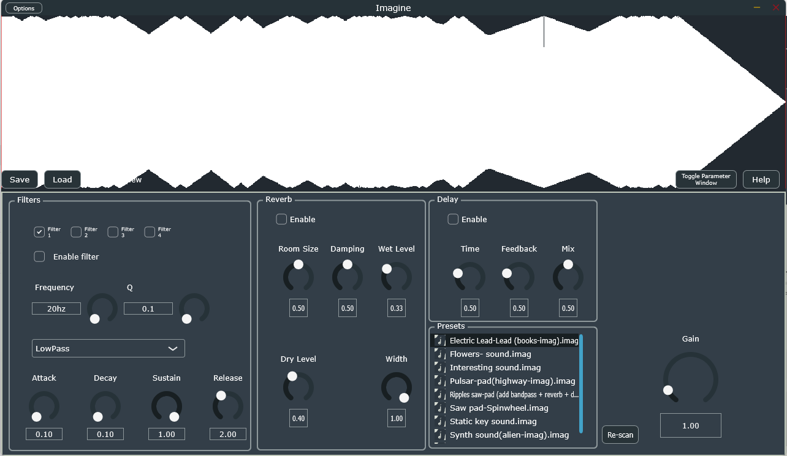

# Welcome to Imagine a Standalone program and VST that converts images to sound!

Imagine is a synthesizer that generates sounds from images developed as a CAPSTONE graduation project by myself and - [@Adrian Irizarry](https://github.com/Adrian649).
Development started in early October and we now have a release that works and can be used as an early build look.

## Requirements:

- Python 3.13 (if you are on windows the intaller will install all dependencies)
- Windows/Mac/Ubuntu if you know how to make vsts work
- numpy
- scipy
- pillow
- images in jpg format or you can download presets of type .imag

## How does it work

 Sound generation begins with any JPG image the
user decides to drag into the program. Using Python
this image will go through convolution to extract values such as
mean of each color channel, saturation and brightness. Using
these extracted values the generation of the fnal waveform
begins. A base tone will be created according to the dominant
color of the image. After the generation of this base tone the
resultant sound will be modifed by the following audio synthesis
techniques:
- FM synthesis (Frequency modulation synthesis) This
method adds modulation to the generated base tone based
on the dominant color channel. The envelope intensity
and frequency is influenced by the dominant color
- Additive synthesis (Overtones) Overtones will be
generated as separate signals where their frequency is
determined by the harmonic series. The number of
overtones is determined by a seed extracted from the
image meanwhile the intensity of said overtone falls
linearly with a variability factor controlled by the
seed generated from the image.
- LFO generation: The amount of low frequency oscillators
to be applied to the sound will be determined by a
formula which uses the color average as a factor to
affect the result. To then determine the kind of wave
for each oscillator we will use whichever the maximum
value is between the averages from the three color
channels. Finally to determine the frequency we use the
saturation value to get a value between 0 Hz to 30 Hz.

## Whats next + Bugs found
We plan on updating the program in the future to fix bugs and add more features.
- We have identified bugs in the thumbnail not updating in certain occasions, this can be fixed by clicking on the thumbnail.
- We have identified sound restoration not being automatic when the plugin is in a DAW and the host is closed and reopened.
- If you find other stuff let us know.

## What comes next
- Bug fixes
- Adding a custom synthesizer class.
- Adding more effects like resampling the generated sound.
- Updating and enhancing the generation script to add more synthesis techniques to the sound generation.
  

